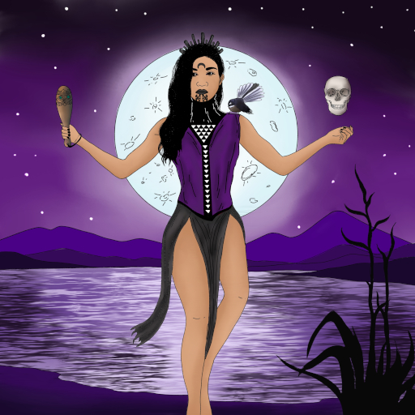

# Avatars

Here is an archive of the avatars I have used. Since 2015, I commission my
avatars from artists with a very loose mandate, letting them do whatever
they want within as few parameters as I need. Generally, no detail beyond
sizing was requested, although the exact brief varied for each artist.

All are copyrighted. Do not reuse.

---

## Bast Lighthouse

Commissioned from [PepperRaccoon](https://pepperraccoon.com)
in <time datetime="2021-W06">February&nbsp;2021</time>, and
delayed from publication until
<time datetime="2021-W28">July&nbsp;2021</time>
whereupon I gave it [a little introduction](https://twitter.com/passcod/status/1413892122848026626).

---

## Cybear

Commissioned from [Tayruu](https://twitter.com/Tayruu)
in <time datetime="2020-W33">August&nbsp;2020</time>, and
completed in <time datetime="2020-W37">September&nbsp;2020</time>.

---

## Māhina

Commissioned from [Huriana Kopeke-Te Aho](https://twitter.com/maorimarxist)
in <time datetime="2019-W06">February&nbsp;2019</time>.

---

## Sasha

Commissioned from [Sarah Lund](https://twitter.com/PlaidCushion)
in <time datetime="2018-W25">June&nbsp;2018</time>, completed in
<time datetime="2018-W33">August&nbsp;2018</time>, and delayed from
publication until <time datetime="2018-W41">October&nbsp;2018</time>
to give the <b>Cup Cat</b> a reasonable amount of time.

---

## Cup Cat

Commissioned from [Azu](https://twitter.com/azuria_sky)
in <time datetime="2018-W28">July&nbsp;2018</time>.

---

## Snowl Herder

Commissioned from [Eoghan Kerrigan](https://twitter.com/eoghankerrigan)
in <time datetime="2017-W37"><del>July</del> <del>August</del> September&nbsp;2017</time>,
and received in <time datetime="2018-W03">January&nbsp;2018</time>.

This was an experiment in commissioning larger pieces and selecting a crop
myself for the avatar itself. While I'm pleased with the results, I'm not
sure whether I'll continue with this format going forwards. You can see the
larger artwork by clicking on the avatar image.

---

## Framing

Commissioned from [Luke](https://twitter.com/LukrShiba)
in <time datetime="2017-W22">May&nbsp;2017</time>.

---

## ACLU sketch

Obtained as a donation reward for the ACLU. Only worn on Twitter for the month
of <time datetime="2017-W21">May&nbsp;2017</time>.

---

## Into Space

Commissioned from [Alison Graham](https://poweredbycokezero.com/)
in <time datetime="2017-W09">February&nbsp;2017</time>.

---

## Nekudotayim Three

Commissioned from [Daniel Silva](http://boymilk.myportfolio.com)
in <time datetime="2016-W38">September&nbsp;2016</time>.

---

## Hearty Hug

Commissioned from [Sam Orchard](http://www.thesamorchard.com)
in <time datetime="2016-W22">June&nbsp;2016</time>.

---

## Demon mask bird

Commissioned from [Anne Szabla](http://www.aszabla.com)
in <time datetime="2016-W11">March&nbsp;2016</time>.

---

## Sailor whale

Commissioned from [Sara Goetter](http://sgoetter.com)
in <time datetime="2015-W23">June&nbsp;2015</time>.

In <time datetime="2015-07-05T04:46:00+12:00">July</time>,
[Tailsteak made a variant](https://twitter.com/tailsteak/status/617706008937373697).
It was never actually used as an avatar.

---

## Beaver with a jetpack

Commissioned from [Mason Williams a.k.a. Tailsteak](https://tailsteak.com)
in <time datetime="2015-W07">February&nbsp;2015</time>.

---

## Léa and me

In <time datetime="2014-W07">early&nbsp;2014</time>, I changed my avatar to include my
significant other of the time. This was taken on the Dune du Pyla in France.

---

## Close-up of me

From <time datetime="2011-W30">mid-2011</time> onwards, I used an extreme close-up of
my face. This was my longest-lasting avatar and probably still remains in use in some
accounts I haven't bothered cleaning up.

---

## Blue screen of code

Around <time datetime="2009-W15">2009</time> and onwards (I wasn't on the internet much
at that time), I used this as an avatar. I probably lifted it from Google Images.
