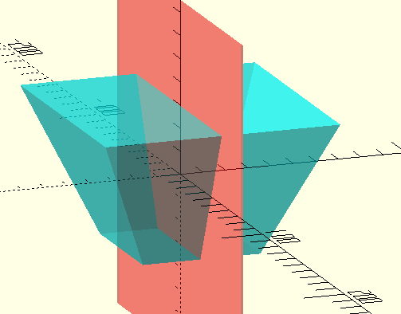
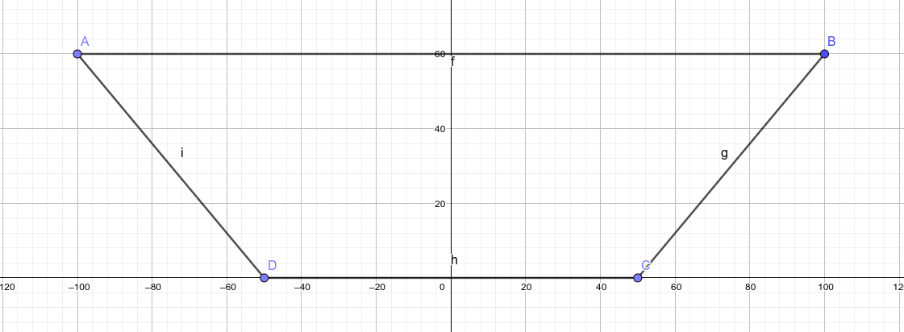
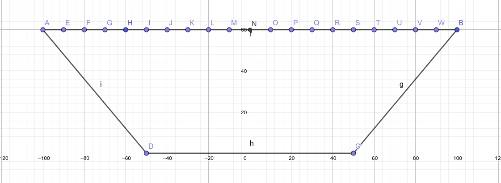
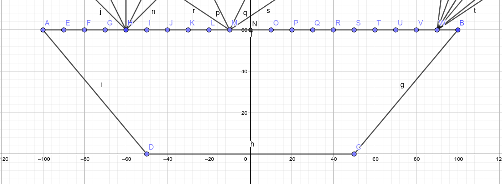
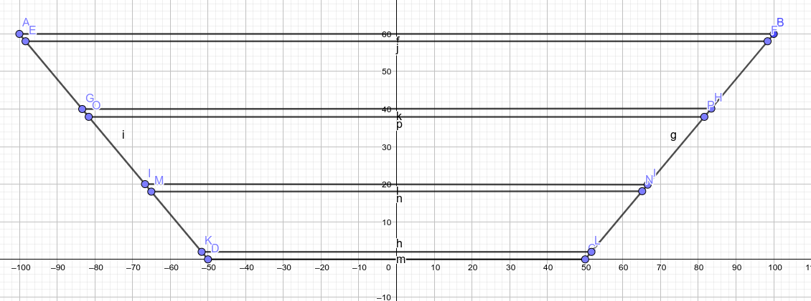

# A cost-effective AGILE

> August 2022 **Work in progress**

## Background

Earlier this year [I got interested] in [a Stanford article] and [a Nature paper] that used a device
called an AGILE (Axially Graded Index LEns) to enhance solar panels. An AGILE is a complex bit of
glass-like plastic that resembles an upside-down truncated cone or pyramid.

I'll quickly summarise the papers:

The principle is pretty simple: the pyramid is made of a series of horizontal layers with increasing
refractive indices going deeper (towards the narrow end), and the sloped sides are coated with a
reflective material. Any light that enters the wide top of the device is curved towards the bottom
by the successive layers, and reflecting against the sides only increases the effect due to the
angle. In the end, all light that enters the top of the AGILE at any angle will exit at the bottom.

Due to the angle, the top surface is larger than the bottom, which means that light is effectively
concentrated. At a wild guess, if the top surface is four times the bottom, then the light will be
four time concentrated on average.

The AGILE also concentrates input light that arrives at any angle and curves it such that it
exits the lens at angles that are bound by the angles of the device.

These properties make AGILEs an attractive solution for increasing the cost-effectiveness of solar
panels: not only can the active surface (the part actually covered in photovoltaics) be reduced
compared to the solar panel's total surface, but the panel can operate at much wider input angles,
which is a well-known issue with solar installations, and it does so with a static and completely
passive device that doesn't require much overhead in terms of space.

[I got interested]: https://twitter.com/passcod/status/1548245821426401282
[a Stanford article]: https://news.stanford.edu/2022/06/27/new-optical-device-help-solar-arrays-focus-light-even-clouds/
[a Nature paper]: https://www.nature.com/articles/s41378-018-0015-4

## Building one

[This paper][vaidya2011] describes how to build an AGILE:

1. Obtain a set of optical (i.e. extremely clear) resins that can be cured with UV and have a range
   of refractive indices (RI) when cured. Remember this bit.
2. Build a mould: a 3D printer does the trick here, plus some post-processing (sanding) to smooth
   the sides. The researchers seem to have directly built the negative, but it might be easier for
   repeatability and ease of demoulding to print the positive and make a silicon mould.
3. Pour a layer of the highest RI resin.
4. Cure it with a UV lamp.
5. Repeat 3–4 with decreasing RI resins.
6. Demould the pyramid, finish the edges.
7. Coat the angled sides with a reflective layer. It might be sufficient to spray paint a high
   concentration mixture of silver pigment powder and acrylic base, or a deposition process could be
   used with silver nitrate.

So, that's pretty simple, and it sounds doable in DIY, right?

Step one, obtain a set of optical resins, like, uhhh, [these ones][norland]. Wait, what's the price
of those? Uhhh $230 USD per pound, so about $500 USD per kilogram. And you'd need at least five, so
for a kg of each that will come to a shiny $2500 USD just to get started. I can't imagine we'd need
_less_ than about a kilo total per panel, given some maths that I'll leave to reader discretion, so
at a glance we're looking at a cool $500 USD per ~standard two square metre solar panel. Plus the
cost of the photovoltaics and frame and so on, but that's decently cheap, on the range of $100 USD.

So we're looking at a device that _at least quintuples_ the cost of a solar panel, just to get some
better utilisation in the mornings and evenings. Not very cost effective, _and_ prohibitive for DIY.

## Alternative materials

Can we find alternative materials that are much cheaper and would allow us to control their RI?
Well, solids are a no. Resins are it, and finding optical-grade resins with precise RIs... we're
back at square one. Glasses are a no-go. Diamond and other lattices or crystals are also exorbitant.

What about liquids? No, hear me out.

Glycerol (also called glycerine) is "[a colorless, odorless, viscous liquid that is sweet-tasting
and non-toxic][wiki:glycerol]." It's also miscible in water. And it has a RI of 1.46. Water, by the
by, has a RI of 1.33.

Mixing glycerol and water at varying ratios _changes the RI of the mixture_ in between these two
extremes. Further, adding a water-soluble compound, like sugar or salt, may _increase_ the RI, for
some fine tuning.

So, if we can create water-glycerol compounds at precise ratios, we can possibly get a set of
colorless odorless non-toxic liquids that have a range of RI, from 1.33 to 1.46.

We can then layer these liquids, partitioned by much thinner pieces of a strong plastic, like
acrylic which has a higher RI at 1.50, but the thickness difference should make that negligible. The
bottom of this new AGILE can then be a thicker bit of acrylic, for the final step at 1.50.

What's the cost of glycerol? [Less than $10 USD per kg][purenature]. Acrylic sheeting is about $20
USD per square metre depending on thickness and retailer. Water will need to be pure or distilled,
and that costs about $0.50 USD per litre.

Pro: we're looking at something about 40 times cheaper than with resins.

Con: it sounds absolutely bonkers.

[vaidya2011]: https://snfexfab.stanford.edu/sites/g/files/sbiybj8726/f/sections/diplayfiles/ee412_finalreport-gradedindex.pdf
[norland]: https://www.norlandproducts.com/adhchart.html
[wiki:glycerol]: https://en.wikipedia.org/wiki/Glycerol
[purenature]: https://www.purenature.co.nz/products/vegetable-glycerine-refined-palm-free?_pos=3&_sid=dc0f74cf3&_ss=r

## Preliminaries

We need to do a few things before we can actually get to the hands on bit:

### Build or obtain some kind of rig or tool to measure RI

// TODO

### Find some photovoltaic cells (not entire panels) and rig at least one to measure output current

Finding them is easy: AliExpress has a selection, and I picked [one][ali:pv].

[ali:pv]: https://www.aliexpress.com/item/4000511987311.html

// TODO

### Figure out what the optimal size of the device and the number, RIs, and thicknesses of the layers is

This is probably the bit you're here for. The rest of the article will be updated when I make
progress on the physical construction of the object.

I want not only to construct an AGILE, but I want to construct the _best_ AGILE I can with my
constraints. To do that, I'm going to define a model for simulation, parametrise it, assign a score
to a parameter set, and then run an exhaustive search on the parameter space, to finally rank and
find the ideal AGILE I can make.

"Exhaustive? That's gonna take forever!"

Well, I'll use Rust for the actual compute, and I'm going to start by strictly defining the model to
both get an idea of the possibility space and to figure out how many calculations I'll need to do,
as well as a simple estimate of how long it will take.

#### The model

So, I'm going to take the AGILE object, and I'm going to cut a section down the middle:



Which will look like this in 2D:



On that top surface, in the diagram labelled A–B, I'm going to define a series of entry points at
regular intervals starting from one end (A) to the other (B). The distance from the last point to
the end will not always be an exact interval, of course. In the below diagram I'm showing points
every 10 units, but in the actual simulation I'm going to go with every 1mm for extra precision.



From each of these points I'm going to define a set of angles of incidence. Again in the diagram I'm
showing only a few angles on a few points for clarity, but in the simulation I'll go with integer
angles from 1° to 179° inclusive, except at the two extremes where it doesn't make sense, and the
range will be bound a little tighter.



For each of these angles at each of these points, I'll compute the path the ray of light takes
inside the lens, where it exits, and at what angle. Then, over the the entire set of rays of a
particular parametrised AGILE, I'll calculate:

- the proportion of rays that exit at the bottom (higher is better)
- the average exit angle for those that exit at the bottom (closer to vertical is better)
- the length of the path the light takes inside the lens (lower is better)

Combining these three measures, weighted in that order, will produce a single score for any given
parameter set. Getting that score will mean computing 178 (entry angles) × 105 (entry points) rays
given a fixed 104mm top width for the section, so at most 18690 rays per param set.

#### Model parameters

So, the way the AGILE is going to be constructed, it's going to be a laminate of thinner
_partitions_, made of acrylic, and thicker _layers_, which are filled with a liquid. The top and
bottom will be partitions, and there will be a partition in between each layer.



The thickness of the partitions is the same for all, and for model simplicity I'll say that the
thickness of the layers is also the same through the AGILE. If the model works out to be
sufficiently fast, these could be made to vary, to possibly get more options or better optimisation.

The RI of each layer will be a variable. For model simplicity I won't constrain the layers to be in
increasing RI top to bottom; that's likely what it will work out to anyway but maybe there will be
some surprising behaviour coming out of that.

The number of layers will also be a variable.

The width of the bottom is set to 52mm because that's the size of the PV cell tiles I've bought. I'm
going to set that the top width be 104mm, exactly twice, for now. Making it a variable increases the
possibility space a lot; for now I'll keep it fixed.

With all this, the height of the pyramid will be determined entirely by the variables above.

The variable set will be described like this:

```rust
struct ParamSet {
  /// RI of the layers
  ///
  /// This specifies both the _amount_ of layers (number of elements in
  /// the slice) and the _refractive index_ of each.
  layers_ri: &[f64],

  /// Thickness of each layer in tenths of mm
  layers_thickness: u32,

  /// Thickness of each partition in tenths of mm
  partitions_thickness: u32,
}
```

On top of this, there will also be some bounds:

- The number of layers will be minimum 2, maximum 10. Two is the minimum useful, ten is arbitrary.
- The thickness of partitions will be minimum 0.2mm, maximum 3mm, in increments of 0.2mm. These are
  supply constraints, save for the maximum which is arbitrary.
- The thickness of layers will be minimum 3mm, maximum 30mm, in increments of 0.1mm. The bounds are
  arbitrary on a general gut feel of what will be useful; the increment is the precision of a 3D
  printer.
- The refractive indices will be minimum 1.33, maximum 1.50, in increments of 0.01. I don't yet know
  if it will be possible to measure or control RI to that precision, but it seems more likely than
  0.001. The minimum is water (1.333), the maximum is acrylic (1.50): we could totally have a layer
  that it entirely acrylic. RIs between 1.46 (pure glycerol) and 1.50 are yet unknown if they are
  achievable (with additives?) but it would be easier to _exclude_ results with these values rather
  than not generate them in the first place and then find out we could have.

So, to finish our estimate and get onto the modelling work:

- Number of layers: 8 possibilities
- Thickness of layers: 270
- Thickness of partitions: 28
- Refractive indices: 17 increments per layer, so 17×8=136 worst case

Possibility space is thus at most 8×270×28×136 = **8 225 280**.

Multiplied by the amount of rays to compute for each param set, we need to perform about 154 billion
ray computes, or about 4 trillion individual refraction and reflection calculations. From some early
prototyping, I'm fairly confident in saying I can achieve a ray compute in at most 0.1ms. That would
work out to a week of compute over 24 cores.

...welp, I hope I can do better!
