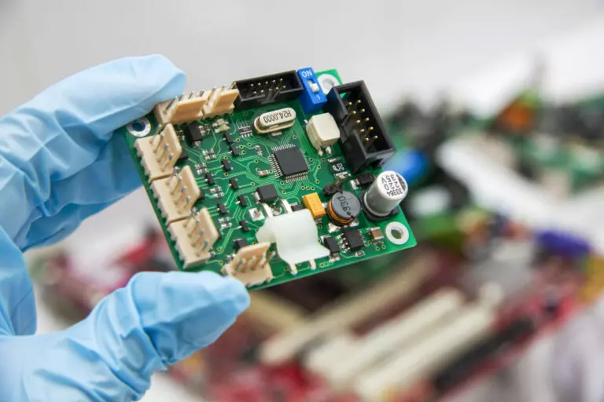
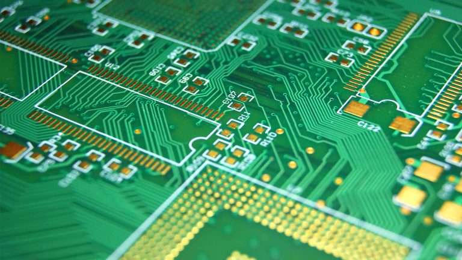
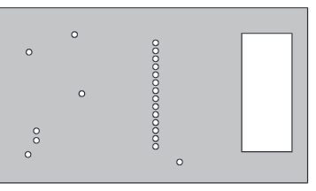
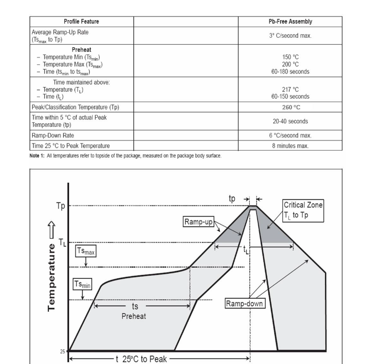
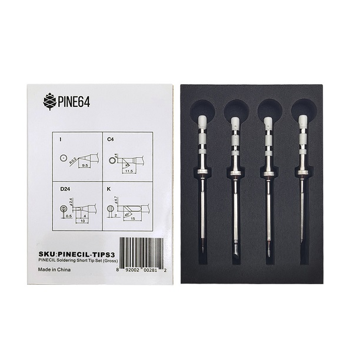
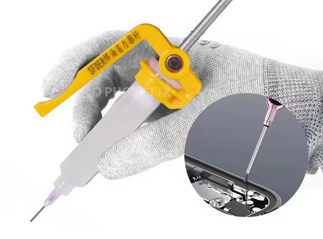
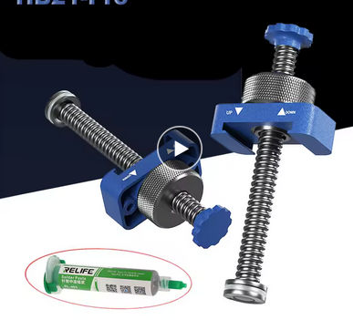
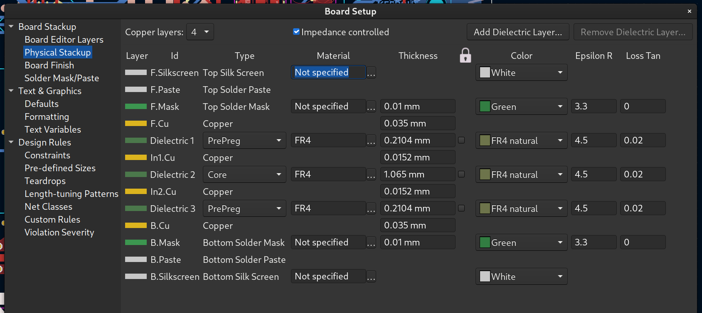

<!-- vim: set tw=100 : -->

# Learning electronics design

> January 2025

This is a bunch of things that I wish I'd known or been told about when I was starting in the hobby
of designing and tinkering with electronics, including soldering, assembly, ordering, designing...
This came about after I had a 5-minute call which turned into a 90-minute call with someone just
starting in this, and while I'm very much a beginner hobbyist myself there's still **so much stuff**
I wish I'd known, that I told that person about, and more that I didn't because it was already
getting way too long. This page is a work in progress / living document: it will be updated with
more as I think of it, and then also as I learn more, and if more-experienced people give feedback.

The document is currently about 20% done (i.e. 20% to documenting the current state of my knowledge
in this field). You may want to check back in a while as I complete more of it.

* auto-gen TOC;
{:toc}

# Rules

In EE, "rules" are more like guidelines. You'll find plenty of advice for contradictory "rules" and
many rules can be broken "if you know what you're doing" or if you accept the tradeoffs. That said,
as a beginner it's worth following rules as much as you can, as you most likely _don't_ "know what
you're doing" or understand the tradeoffs.

There's also a tremendous amount of advice out there that is outdated or based on little else than
"it's always been done that way." Unfortunately as a beginner you (and I) won't have the knowledge
to discount those, or to be able to decide if a piece of advice only really applies to certain use
cases and not your own. [Robert Feranec](https://www.youtube.com/@RobertFeranec)'s YouTube channel
is pretty great here.

# Terminology

## EDA, CAD, Gerber, BOM

Computer Assisted Design or CAD is both the practice and more typically as a shorthand the
_software_ used for designing something.

EDA is Electronic Design Automation, and similarly EDA is typically used to refer to EDA _software_
which is specialised CAD for electronics design.

I use [Kicad](https://www.kicad.org/) which is free (and open source), you'll also see [Autodesk
EAGLE](http://eagle.autodesk.com/) especially on older resources as EAGLE is discontinued, and
[Altium](https://www.altium.com/) and [Keysight] which are leading professional solutions.

[Keysight]: https://www.keysight.com/us/en/products/software/pathwave-design-software/pathwave-advanced-design-system/pathwave-ads-rf-microwave-circuit-design.html

There's also more experimental solutions like [Horizon EDA](https://horizon-eda.org/) which focuses
on an excellent experience for building and maintaining part libraries, various efforts to make
programmatic EDA like [pcbflow](https://github.com/michaelgale/pcbflow), and online EDAs typically
as part of a low-cost fab's offering, like [EasyEDA](https://easyeda.com/).

All EDAs output **Gerber**, which is a file format that describes how to print the copper, solder
mask, silkscreen, solder paste, and where to drill and the board stackup, **BOM** (Bill Of Material)
CSV files which describe which components are required for assembly, and **pick-and-place** CSV
files which describe where to place components (used by pick-and-place machines for automated
assembly).

## PCB, Board

The Printed Circuit Board is generally _just_ the board, that is, the laminated stack of etched
copper and core and prepreg, not including the components mounted on it. By extension, a _populated_
("that has the components attached") board will also be called a PCB as a whole, by opposition to
the wires, screws, enclosures, and such.

The distinction can be important when talking about a particular design, e.g. "how is this connected
on the PCB" refers to the traces within the circuit board rather than any external wiring or by
components. (Although there can exist "zero ohm resistors" or "solder bridges" which are technically
components that provide trace continuity outside of the board itself.)

A "bare" or "unpopulated" PCB is one without any of the components attached yet.

## Layers

A PCB is a laminated (glued together) stack of conductive and non-conductive material.

Typically when talking about layers we're talking about the conductive layers. Prototype PCBs will
typically have 1, 2, or 4 conductive layers. Advanced PCBs may have 6, 8, 12, all the way up to 32
layers (or even more!).

The PCB also includes dielectric or non-conductive layers, in between and above and below the
conductive layers. Typically conductive layers are called "copper" layer; most of the time they
_are_ literal copper but there's also other technologies out there.

Dielectric material is typically FR4 (which stands for Flame Retardant grade 4). That's a weave of
fibreglass impregnated by resin. In very cheap in-house prototyping ([Steven Hawes
(2025)](https://www.youtube.com/watch?v=wAiGCyZZq6w)) you might also see FR1 which is a kind of
cardboard. There's also ([Ike-Eze
(2023)](https://www.researchgate.net/publication/369913845_An_Overview_of_Flame_Retardants_in_Printed_Circuit_Boards_for_LEDs_and_other_Electronic_Devices))
FR2 (more durable FR1), FR3 (cardboard and epoxy), FR5 (high-temperature FR4, typically for
automotive), CEM-3 (epoxy composite, newer advance on FR4), Polyimide (flexible film for flexible
PCBs), PTFE (teflon, high frequency flexible PCBs), and Aluminum (cheaper, thermally conductive) as
well as other metals ([Burr
(2013)](https://www.researchgate.net/publication/263565968_Printed_circuit_board_technologies_for_thermal_management)).

In a **stackup** (the specification of electric and dielectric materials and their layer thicknesses
in a board), you'll often see a difference between "core" and "prepreg". These are manufacturing
concerns: "prepreg" is uncured dielectric material that is applied between layers _during_ board
manufacture, while "core" is dielectric material that is pre-assembled between conductive layers and
cured into rigid sheets prior to manufacture, typically by a different factory ([Neil\_UK
(2018)](https://electronics.stackexchange.com/q/356072)).

Finally, on top of the front and back outer layers several coatings are done:

- a protective non-conductive coating called the **solder mask**, which masks off the areas that
  _don't_ need to be soldered or conductive (this is what gives the typical green colour of PCBs,
  though other colours are available but more expensive).
- a protective conductive coating applied to the non-solder-masked areas, called the **surface
  finish**. This is either HASL (Hot Air Solder Leveling), which covers the exposed copper in
  solder, Lead-Free HASL (HASL but with lead-free solder), or ENIG (Electro-less Nickel and
  Immersion Gold), which is a nickel coating that is further finished with a thin gold plating, and
  gives the characteristic yellow colour of pads. HASL is cheap, Lead-free HASL is a bit more
  expensive, and ENIG is expensive. Typically I'll use HASL for prototyping (as long as you're not
  licking the board, leaded HASL is fine).
- a decorative printed ink layer called the **silkscreen**, which provides text and graphics, such as
  for component outlines and reference designators (used for hand-assembly and debugging), connector
  port names, assembly instructions, branding, revision/version information, etc. This is typically
  a single colour, often white unless a lighter solder mask colour is used like yellow or white; in
  some fabs multi-colour silkscreens are available (but expensive).

## Traces, planes, pours, thermal reliefs

A **trace** or track is a continuous bit of conductor within a PCB. Typically a trace is on a single
layer, and traces on different layers are connected with _vias_, but by extension one can talk about
an entire multi-layer connection between two or more pins as a single trace.

A **plane** is when an entire layer is one sheet of conductor. There can be small holes (for vias or
keep-out zones) and there can be small bits of other traces within the plane in some cases where
it's not possible to do otherwise, but one does not want to _split_ or _break_ the plane ([TI
(1999)](https://www.ti.com/lit/an/szza009/szza009.pdf)): to have sections of the plane that are
separate or almost-separate from each other.

Power planes can be different here, though [Bogatin (2021)] recommends not using power planes
anyway.

**Pours** are when you flood the "empty spaces" on a signal layer with copper, which you generally
attach to ground or leave floating.

Pours on signal layers are generally considered a bad thing for signal integrity reasons, see
[Bogatin (2022)], [SteveSh (2020)](https://electronics.stackexchange.com/a/481066/355126). However,
pours on outer layers specifically are often required for manufacturing yield, see [JLCPCB
(2024)](https://jlcpcb.com/blog/the-importance-of-copper-pour-in-empty-areas).

[Bogatin (2021)]: https://www.youtube.com/watch?v=kdCJxdR7L_I
[Bogatin (2022)]: https://www.amazon.com.au/dp/163081962X

**[Thermal reliefs](https://en.wikipedia.org/wiki/Thermal_relief)** are wheel-spoke attachements
from pads to copper pours and planes for the purpose of limiting thermal conductivity while still
having a good electrical connection. You typically want to limit thermal conductivity so that it's
easier to solder, especially for through-hole components.

Kicad has an option (in a Zone's properties) to specify that all plated through-holes attached to a
zone must have thermal reliefs.

It's somewhat common to write text or graphics into the (outer) copper layers for branding purposes,
in a similar fashion as the silkscreen but more discreet and harder to alter. It's also possible to
have such decorations on inner layers, though that's more of an easter-egg or for quality-control
purposes as those wouldn't be visible except using X-Ray inspection or by delaminating the board.

## Components

Components are the devices mounted to a PCB. These can occasionally be entire PCBs in their own
regard.

### Pins, connectors

**Pins** have a double meaning: it can either refer to physical pins, which are thin conductors you
can connect to, like for pin headers or within connectors; and it can also refer to the physical
numbering and logical assignment of signals to connectors of an IC.

For example, you can refer to "a ground pin" or "the clock input pin" or "pin 1" and those will mean
the connection on an IC, but in "pin headers" the term refers to the exposed cylinder or square
section of metal that's sticking up which you can connect female Dupont or jumpers to.

### Through-hole, THT, Leaded components

THT is Through-Hole Technology. Leaded components refers to components which have _leads_ i.e. long
thin wire legs, for the pins. This includes both [Axial packages for passives like
resistors](https://www.microhm.net/m/news/articles/1377.html) and [DIP packages for
ICs](https://en.wikipedia.org/wiki/Dual_in-line_package) and [TO packages typical for
transistors](https://en.wikipedia.org/wiki/TO-92), among many others.

Through-hole components are soldered by passing each _lead_ through a plated hole, and then soldering the
legs to the holes.

### SMD, SMT

SMD means Surface Mount Device and SMT is Surface Mount Technology. Technically SMD should be for
components and SMT for the process but in practice these are used interchangeably.

SMD components either have leads that are folded to sit flat on the PCB, or are "lead-less" or
"non-leaded", which means they have a connective surface as part of the package but not "sticking
out" like a leg. Compare [SOIC](https://en.wikipedia.org/wiki/Small_outline_integrated_circuit) and
[SOT](https://en.wikipedia.org/wiki/Small-outline_transistor) with
[QFN](https://en.wikipedia.org/wiki/Flat_no-leads_package).

Surface mount components are soldered by positioning the entire package on its PCB footprint such
that the legs coincide with the pads, then soldering. Often this is done by adding solder paste
before positioning, as that allows for pads that are fully under devices where they wouldn't be
accessible otherwise.

"Hand soldering" (using a soldering iron) of SMD components is sometimes possible but requires
forethought as the pads should be larger to allow for iron surface access.

### Hybrid

You can have components with both through-hole pins and SMD pins. Connectors are often like this:
through-hole connections provide a strong _mechanical_ binding but SMD pins require less space and
only a single layer.

Often you'll have just the mounting pins (non-electrical connections) as THT. Some components can
have both SMD and THT signal pins, such as [this USB-C
connector](https://www.mouser.com/datasheet/2/837/usb4230-3507435.pdf).

## Holes, vias, mounting holes, PTH, NPTH

A **hole** is an opening in a PCB. We generally distinguish between conductive holes and non-conductive
holes: non-conductive holes are used for mounting (fitting screws and posts to physically mount the
PCB to an enclosure or support, or for fixing components to the PCB) and mechanical concerns (like
stress relief for cables). Conductive holes are used for connecting layers together (vias), or for
connecting through-hole components.

**Vias** are holes that are plated on the inside of the hole specifically such that an electrical
connection is made between layers that are connected to the hole. Full size vias have a large hole
and thus a large area inside the hole for the connection, micro vias have much smaller diameters,
blind and buried vias are holes that don't go all the way through, used in 4 and higher layer PCBs
to connect two or more layers without intruding on the other layers. Blind vias go from a side but
stop before the other side, and buried vias only exist within the board, and don't protrude on
either side. _JLCPCB and other low-cost fabs typically don't support blind and buried vias._

Kicad will default micro vias to be buried; you can still use non-buried micro vias by changing the
via type to "Through" in the via properties, and optionally setting "pads only on connected layers".

**PTH** and **NPTH** are typically used for non-via holes to describe their footprint. PTH means
Plated Through Hole, which is when the hole will be plated on the surface, that is it will have a
ring of conductor on the outer layers. NPTH means Non-Plated Through Hole, where the plating is
absent. PTH can be used to connect mounting holes to the mounting screws thermally and electrically
as well as mechanically.

Make sure to consult your fab's restrictions for hole size and clearances, and set those as defaults
in your EDA's board settings _before you start layout._ There's nothing more annoying than redoing
layout for a bunch of traces because your vias are too small for the fab.

## Ground, floating, not connected, not internally connected

**Ground** is the common "zero voltage" level. There can be multiple types of ground in a board, and
occasionally you'll have boards that have multiple isolated grounds. Sometimes you'll also have two
types of grounds that are nonetheless connected.

Some different types of grounds:

- signal ground (typically a downward triangle)
- chassis ground (looks like a rake), that's when you're connecting to a metal enclosure or chassis
- earth ground (looks like parallel horizontal lines in the shape of a downward triangle), that's
  connected to the earth e.g. when working with mains electricity
- digital ground vs analog ground, often when you have a power management IC the digital control
  lines like SMBus or I2C will have their own ground area from the power lines' ground area, even if
  these are stiched together by vias, such that the noise from the power lines doesn't affect the
  digital lines.

**Floating** means a conductor that's not attached to any voltage level or ground. The conductor
will basically have some random value at any given point, as it acts as the receiver for any
electromagnetic fields that are generated by the surrounding circuit or environment.

If you have a pin on a chip that you don't care about, typically you still want to connect it to
something so that the value is fixed (to either ground or signal high) and it doesn't "float"
between values at random, which could cause it to appear to be a signal to do something to the chip.

Generally pins that can be left floating will specifically mention that.

**NC** or **Not Connected** pins should not be connected to any trace, but should still have a pad (the pad
should be left floating). Those pins might not be used as signal pins but they could be used
internally for thermals or mechanically.

**NiC** or **Not Internally Connected** pins are explicitly not connected to anything inside the chip. This
means that if you want, you can use those pins as conductors for other signals, which may help for
routing.

Not all datasheets make the difference between NC and NiC; sometimes you can know you can treat an
NC pin as NiC from usage, but without it being mentioned in the documentation. It can be risky to do
that if the manufacturer ever decides to change the internals of the chip; an NiC mention is an
explicit guarantee, but its absence leaves the manufacturer to do whatever they want.

# Soldering

There's several ways to do soldering. The three main ones are:

- with a soldering iron
- with hot air, either with a hot air gun or station or with a heated chamber or oven
- with a heated table

For hobbyist use you'll want at minimum:

- a [soldering iron](#iron)
- a [heated table](#heated-tables)
- an [iron cleaning station](#iron-cleaning)
- a syringe of [low-temperature solder paste](#melting-point)
- a [syringe of flux](#flux-forms)
- a [spool of lead-free solder wire](#solder)
- [ventilation and PPE](#ppe)

## Flux

If you're doing soldering you need flux. If you don't know what that is, either you've already been
using it and didn't know the name, or your soldering is going to get _immensely easier_ once you
read this.

Flux... makes soldering _work_. It's honestly hard to explain _what flux does_ without experiencing
it. Wikipedia [says](https://en.wikipedia.org/wiki/Flux_(metallurgy)#Soldering):

> flux serves a threefold purpose: it removes any oxidized metal from the surfaces to be soldered,
> seals out air thus preventing further oxidation, and improves the wetting characteristics of the
> liquid solder.

The way I describe it is that like some materials (like butter) are
[hydrophobic](https://en.wikipedia.org/wiki/Hydrophobe), flux is _solderphobic_. It makes solder
want to stick to itself and to other metals more than it wants to stick to non-metals, including
flux itself.

So if you put flux around a metal joint, and then you add solder, the solder is going to "want" to
attach to the metal joint and to the pin or connector leg that you're trying to solder, and _not_ to
anything else. And when *de*soldering, if you can push flux "under" some solder, it's going to make
that solder way easier to remove from the metal.

### Solder paste

Flux is also what makes solder paste and SMD soldering work. Solder paste is essentially flux with
small particles of solder suspended within it. Like you're taking solder, crushing it into a powder,
and then you thoroughly mix that with flux, and that's solder paste. When you heat solder paste, all
the little particles of solder clump together and to the nearest exposed metal, and avoid non-metal
areas. So you then have a blob of solder that's situated on the pads you want to solder _and_ coats
the entire surface of the pad without going over the boundaries of the pad (unless you have so much
solder it "overflows").

### Flux forms

Flux comes in two common forms:

- a tin of rosin, which is pine tree sap and also used by violonists and in the medical field;
- a syringe of liquid-at-room-temperature flux (this might be diluted rosin or some other compound).

Soldering kits will typically have a tin of rosin. That has its uses, but is honestly annoying and
non-obvious; buy a syringe of flux and a [syringe applicator](#syringe-applicators) and you'll have
a much better time of it.

## Solder

When buying solder, you can get it in two main forms:

- solder paste (described above)
- solder wire

There's also two main types of solder:

- leaded
- lead-free

Leaded solder is easier to work with, but contains lead, which is [bad for
you](https://en.wikipedia.org/wiki/Lead_poisoning). Opinions vary, but mine is that given solder is
often liquid and sometimes particles of it might spill in places and stick to your hands or
something, there's a higher risk that you're going to be exposed to it; and given that lead-free
solder isn't _that_ hard to work with; you should use lead-free solder.

There's also additives to solder:

- "pure" solder (in wire, bars, or giant vats of molten metal)
- solder paste (solder powder in flux medium)
- solder wire with flux core (solder is wrapped around a core of solid flux)
- antioxidants, antidross, ductability improvers, etc (not typical for hobby use)

Solder wire also comes in different diameters (thickness), like 1.0 mm (typical) or 0.6mm (thin) or
1.5-2.0mm (thick).

### Melting point

Solder is an alloy, and the formulation of the alloy affects its characteristics. One of those is
the melting point. This directly affects how hot you'll do your soldering at. One thing to remember
with this value is that it's really the "solidifying point": if you have 180°C solder, you'll want
to work with it at around 220-250°C, because at 180°C it will be _just barely_ liquid, and not
workable at all. You want it more liquid so you can push it around and so it can flow into joints.

If you're having a hard time imagining this, think of chocolate. When water is freezing/melting, it
goes either hard solid (ice) or free-flowing liquid, there's no middle. But when you heat chocolate,
there's a good range where it's no longer solid but still one block that is kinda soft, and then it
gradually becomes a viscous paste, and when hot it's much more liquid like a thick hot chocolate.

There's a wide range of melting points that various alloys have achieved, from about 90°C all the
way up to 450°C. Most solder melts at around 180°C. You can get "low temperature" solder that
instead melts at 138°C (or around there), and therefore you can work at a lower temperature of
170-180°C.

Low temperature solder generally trades that off by being less flexible when solid, that is, more
brittle. So if you use a low temperature solder for a device that is subjected to vibrations or
shocks, you might find that solder joins break or fracture, where a higher temperature solder won't
have that problem.

Most of the time I use 138°C solder paste and "regular" 1mm 180°C solder wire. I also have various
other solder wires and pastes.

### Temperature on components

Most components have an upper bound as the temperature you can store or solder them at. Generally
that's on the order of 300°C, for a short period of time like a minute. At lower temperatures, you
can more or less safely have components at that temperature for much longer periods of time.

Consult the datasheet for your components. For example, look at this
[BME280](https://www.bosch-sensortec.com/media/boschsensortec/downloads/datasheets/bst-bme280-ds002.pdf)
pressure sensor. Near the end you'll find "Soldering Guidelines", which includes a table and a chart:

This indicates that they recommend soldering at 260°C peak temperature, with a preheat between 150
and 200°C for 60 to 150 seconds. Now, these are _factory-grade_ soldering instructions. For my
hobbyist use, what I take from this is:

- I can't exceed 260°C ever
- I shouldn't spend a lot of time above 200°C if I can avoid it

Given I typically solder at 180°C, that's generally fine, but because this is a miniature sensor,
I'll try to limit even that, e.g. by leaving it for last.

## Heated tables

When doing SMD soldering, you basically have two options: hot air or heated table. I don't have a
lot of experience with hot air, but heated table is very easy and is my preferred soldering method.

> Aside: "hotbed" or "heated bed" is typically a 3D printing term, even though it's conceptually the
> same thing.

The main decision with heated tables is the size of the table. I work with pretty small circuit
boards so I have a NZ$15 55x55mm USB-powered table which fits snuggly under my microscope. For
boards the size of a Raspberry Pi or mini-computer you'll probably want 80x80mm or 150x150mm.

All tables will have:

- temperature control to 10°C
- an ON/OFF heat control
- uniform heating of the table

More dollars can get you:

- bigger size
- larger temperature range
- more precise temperature control
- temperature presets
- timed heating and cooldown curves
- arms on the table to hold your board in place
- digital control (e.g. connects to a computer)

Even with a board that's larger than your table, you can use clamps or standoffs to hold the parts
of the board that go beyond the edges, and only heat the part you're working on. The disadvantage of
this is that your table is going to need to dump a lot more heat to maintain temperature as you're
massively increasing the cooling surface, and you might get temperature gradients across the board
which can be iffy for mechanical reasons.

You're not heating anything to red-hot or white-hot temperatures, which is great for safety, but
also means that you'll have zero indication that something is hot. Heated tables typically have a
temperature display when the heat is off, and may even have it in a "sleep mode." However, if you
disconnect power, that will go away. So always keep your table plugged in until it's reached lower
temperatures (40°C or less). Similarly, keep a hot PCB _on_ the table while it's cooling: you don't
want to take it off the table and then grab it with your bare fingers when it's still 150°C!

If you absolutely have to grab a warm (<100°C) PCB, hold it by the sides (unless you have plated
sides). This will limit your contact area and you'll only be grabbing the laminate insulating
material, not the thermally conductive copper.

## Iron

Even if you use a heated table for 90% of your soldering like I do, you'll still want a soldering
iron. There's... many soldering irons out there. The one I use is a
[Pinecil](https://pine64.com/product/pinecil-smart-mini-portable-soldering-iron/) which is a US$26
USB-powered iron with swappable TS-factor tips.

Generally, you want:

- temperature control to 10°C increments or better
- swappable tips (so you can use different sizes / shapes)
- idle sleep (so it cuts off the heat when idle for a few minutes, which preserves the tip)

If you use a USB-powered iron like the Pinecil, get a silicon cable instead of rubber/plastic so
you don't accidentally melt it when soldering. In fact, get a few cables so you have spares and can
use them for other USB things while soldering (like a [heated table](#heated-table) or
[microscope](#microscope)).

You'll also need a good power supply, like the
[PinePower](https://pine64.com/product-category/pinepower/) or a GaN USB-PD charger or a USB-PD
power bank. Some power supplies don't work with some USB-PD devices, likely because of voltages or
how seamlessly they handle voltage transitions. For example one of my GaN chargers can be used with
the Pinecil, but not with my heated table. Anecdotally, I use [this Baseus 65W
battery](https://www.baseus.com/products/adaman-power-bank-65w-20000mah) with both my Pinecil and my
heated table.

### Tips

Soldering tips come in form factors (`TS` (long) or `ST` (short), suitable for the TS100, Pinecil,
etc soldering irons) and tip types. The tip type is the size and shape it is.

I prefer short length tips as that feels more like a pencil (remember you can't hold the metal bit
of the soldering iron, as that's the hot part!).

Most of the time I use a ST-I tip, which is a short barrel and a conical tip shape at about a 15°
angle. For through-hole soldering work I'll swap in a ST-K or ST-C4, which are thicker rectangular
sections with a 45° angle at the tip, so you can apply a large surface at the working interface.
Both of these are available in [this pinecil tip
set](https://pine64.com/product/pinecil-soldering-short-tip-set-gross/).

A finer tip gives you more control and the ability to target much smaller areas, but the larger area
you can touch with your iron, the more heat you can dump into the touching metal, and so the faster
you can work.

I've bought both gross (large) and fine (small) sets of tips for the Pinecil and I very rarely if
ever use the fine set, even working with SMD components that are <2mm.

### Iron cleaning

Keeping the tip of your iron clean is very important, as a dirty iron tip will not conduct heat as
well (and may even gunk your project). At minimum you want to do a quick clean whenever you start
and stop work, and a deeper clean once in a while. At best you'll want to clean _during_ work too.

A quick clean takes a few seconds:

- rub and push the tip in a brass wool wire ball
- tin the tip (apply a bit of solder to coat the tip)

A more thorough clean is:

- use the brass wool wire for longer
- using a tip cleaner powder/paste (also called a "tip tinner" or "[tip
  activator](https://www.amazon.com.au/dp/B002V7QDZQ)") before tinning
- using a [polishing bar](https://www.digikey.com/en/products/detail/apex-tool-group/WPB1/1801475)
- tin the tip
- repeat the process another time

If you're ever at the point that you feel like using sandpaper, the tip is probably unsalvageable.
Being aggressive with sandpaper runs the risk of removing the iron plating and exposing the copper
core. Copper dissolves into solder, so your tip will quickly die soon after. Additionally sandpaper
grit (the bits of glass/sand that make up the abrasive surface) will contaminate your iron.

Despite what many tutorials say, you shouldn't use a sponge to clean your iron ([Daveca
(2018)](https://forum.digikey.com/t/how-to-clean-tin-and-maintain-soldering-iron-tip/2006/2)), as
bits of sponge will come off and contaminate your iron, and later your solder joins.

## Delivery

### Syringe tips

Syringes for flux and solder paste have a removable _tip_ that gets screwed on. Tips can be entirely
made of plastic, typically in a cone that you cut to obtain the hole you want, or they can have a
long metal tube that has a specific diameter.

The metal ones are usually better because you always know you're getting a set size and because the
tube is long and constant-width you can "see around" it a lot easier than you can with a cone. On
the other hand, if you allow the tip's metal tube to heat, you can have problems where solder will
liquefy inside the tip, gunking it up.

Syringes will usually come with tips but buying a pack of spares in the diameter you prefer will not
cost a lot and will ensure you're not at the mercy of whatever tip size the manufacturer included.

It's really easy to push more stuff out the syringe than you need, so always keep something to wipe
the nozzle with. If you have a soldering iron sponge, use it for this [instead of
cleaning](#iron-cleaning)!

### Syringe applicators

The "push" side of the syringe can be pushed "by hand" with a direct piston, but that's usually very
imprecise and awkward to hold in a soldering context. When I'm pushing solder out of a syringe, I'm
often trying to dispense a millimetre or less out of the solder tip, and the syringe is 15mm wide,
so that's a _tiny_ amount of pressure I need to apply. Instead, buy or make an applicator.

There's two main kinds, squeeze types and screw types.

Squeeze syringe tools fit around the syringe and let you use a finger to squeeze an arm that's
parallel or at a small angle to the syringe's body to dispense some paste.

Screw type syringe tools fit the rear of the syringe and offer a "scroll wheel" which controls a
threaded rod.

I prefer screw type applicators, as they allow much finer control (I often "push" the wheel by a
millimetre or less, which results in about 10 *micro*meters of displacement for the piston) and
removing pressure is obvious and instant. Additionally, I find that I can immediately gauge how much
pressure is applied by the resistance of the wheel.

The screw applicator I use is 3D-printed from [this model by
Dimmu\_Ogir](https://makerworld.com/en/models/474550), though I had to resize the piston end to fit
my syringes.

## Microscope

This [4.3" digital microscope with PC
connection](https://www.amazon.com.au/4-3-Coin-Microscope-Adjustable-Compatible/dp/B0CB5GHG3L), which
is NZ$80 on Amazon, but you can find the exact same for NZ$50 on AliExpress.

You can find more expensive ones with better features but this one is Fine™. It's battery-powered
(less wires in your way) with about 6 hours of work time from full, it's quite intuitive to use, and
you can hook it up to a computer where it will present as a webcam, so you can have a much bigger
screen for it and record/take pictures without fiddling with the micro SD card... or even use it for
streaming if that's your thing.

There's two small caveats with it:

- the built-in screen has a small but noticeable delay (about 100ms). This is less noticeable
  connected to a PC, though still present, probably inherent due to the technology. Most of the time
  it's not an issue, but 100ms is right on the edge of an annoying lag when e.g. typing, so at times
  it can be a minor issue.

- the camera picks up more infrared than human eyes can. You can actually see that a little in the
  screen, with faint red showing up in places that aren't at all red to my eyes. It doesn't pick up
  enough that it would be useful for temperature measurement like an infrared camera, but it _is_
  taken into account by the auto-contrast mechanism. For this reason, when the board is heated up,
  you generally want to turn the built-in light _down_ to get better contrast.

## PPE

You're working with high temperatures (>150°C) and corrosive materials (flux). You should use:

- safety glasses (buy more than one pair)
- non-flammable clothes (no plastic/synthetics)
- ventilation

You may also want:

- some kind of mask
- extraction vents
- filtered fans
- heat-resistant gloves

Ventilation is critical.

Some guides say to work with your head to the side of the work area, not directly above. I... find
this impractical in general, and ineffective anyway. Instead, arrange for air movement to draw fumes
away. You don't need to keep a window open, instead run a cheap $5 USB fan from the side of your
work area pointing slightly or fully away from you, but still blowing gently across your work. That
will disperse any fumes away from your face.

A better solution if you can is an extractor fan: instead of dispersing fumes, pull them into the
fan, and either throw them outside with a duct, or pass them through a HEPA filter, or both.

As a clarification point, what you're trying to avoid is _flux_ fumes and perhaps solder suspension.
Solder itself boils at 1700°C. Just like water, small amounts will evaporate off the surface of
liquid solder, but you'll never get massive amounts of solder vapour like you will for flux and any
impurities in the solder mixes.

# Design

## Mounting holes, heatsink holes, stress relief

Always start by adding your desired board size and shape as the outline, and then immediately add
mounting holes to the schematic, and then to the PCB. If you forget it will be very hard to add
them later, and they'll end up in weird places. For rectangular boards, one mounting hole per
corner is a very good start. For larger boards, consider adding a mounting hole in the center, to
reduce vibrations or the potential for breakage or distension if there's pressure on the board.

As you add the main components, like MCUs, power converters, and other ICs, consider whether you
will need heatsinks for those. If you do, you may want to add mounting holes for those as well.
If you have a wire plugging into a board and going outside of the case, or to a movable part, or
set in such a way that pulling in the wrong direction could cause damage, consider adding stress
relief holes. ([Feranec, 2017](https://www.youtube.com/watch?v=409u7RaraEc))

M3 is a decent size. Holes will have a large clearance around them: this is for the screw head or
fixing post base or nut on a bolt or standoffs; you therefore don't want to violate this clearance
and have any components in there. You also should refrain from routing traces within that area on
the top and bottom layers, as an overtight screw could strip those right out.

## High speed, low speed, high frequency signals

There's plenty of advice and rules that only apply to either high or low speed/frequency signals.
The goal with most of this advice is to maximise signal _integrity_ or _quality_.

High speed is often expressed in frequency, but the true determinant is rise time
([Peterson, 2021](https://resources.altium.com/p/what-high-speed-design)). That is, even if you
don't have a high speed clock signal, you might have high speed electromagnetic waves if you have
short rise times. A 500ps rise time is equivalent to a 2 gigahertz signal.

Something that switches less frequently than once a second (e.g. a power enable line for a voltage
regulator) is never a worry for signal considerations. A line is considered a "signal" from about
1kHz ([Bogatin, 2020](https://www.youtube.com/watch?v=icRzEZF3eZo)).

As a summary:

- below 1kHz: not considered a signal for integrity purposes
- 100kHz: "fast"
- 10MHz: low speed
- 100MHz: high speed signals

For example, PCIE, HDMI, USB 2.0 and higher, Ethernet at 100Mbps or higher... are all "high speed".
However, you can get away with breaking more rules if you're dealing with "low speed" signals like
USB 1.1, 10Mbps Ethernet, or "fast" signals like I2C, 1-Wire, etc. Note that SPI can driven at
various speeds, ranging from "fast" (kHz) to "low speed" (tens of MHz), but is never considered
"high speed".

Also note that Ethernet in particular is highly resistant to rule-breaking. Signal integrity losses
will result in lower effective speeds but generally not errors on the wire.

A great "quick reference" style guide for high speed routing is [TI's SPRAAR7J][SPRAAR7J].

[SPRAAR7J]: https://www.ti.com/lit/an/spraar7j/spraar7j.pdf

## Routing differential pairs

The main activity when dealing with high speed differential signals is routing pairs. Before that,
you need to configure the size and spacing of the conductors in the pair. Before _that_, you need
to figure out and configure the stackup for the board.

To calculate and configure the pairs, see [this Digikey guide from Shawn Hymel (2020)][kicad-diff],
which walks through the process using KiCad, for USB data lines.

When routing, you want to:
- keep the lines over an unbroken ground plane
- avoid branches
- avoid ≥90° turns (KiCad will prevent this anyway)
- avoid crossing other high speed lines
- if you can't avoid a crossing, keep the intersection as short as possible; never have two high
  speed lines overlap vertically over a length
- if you can, keep different pairs separated by three times the conductor-plane gap or more
- if you have to cross the planes:
  - cross to other signal planes, don't route on ground planes
  - put the vias for each conductor in the pair together as possible
  - add ground vias close to the signal vias to allow the return current to cross ground planes
    ([Feranec et al, 2021](https://www.youtube.com/watch?v=52fxuRGifLU)).

Once you've got the routing done, use the skew tool to match the length of conductors within a
pair. For very long traces, you may also need to match the length of pairs to other pairs in the
connection; refer to the device manual as it may have information on these. For example, in the
[Raspberry Pi CM5 manual][rpi-cm5-manual]:

> **2.4. USB 3.0 (Super speed)**
>
> Each USB 3.0 interface supports up to 5Gb/s signalling simultaneously. The differential pair
> should be routed as a 90Ω differential pair. There is no need to match the lengths between pairs,
> only the signals within a pair need to be length matched, ideally to less than 0.1mm. The P/N
> signals of the USB 3 signals may be P and N swapped. The USB 2 pairs can’t be P/N swapped.

[kicad-diff]: https://www.digikey.com/en/maker/projects/how-to-route-differential-pairs-in-kicad-for-usb/45b99011f5d34879ae1831dce1f13e93
[rpi-cm5-manual]: https://datasheets.raspberrypi.com/cm5/cm5-datasheet.pdf

## Stackup

Start by selecting the layer count, then go to your fab and look for their stackup. For JLCPCB,
this is found on the [impedance control page](https://jlcpcb.com/impedance). This page has many
different stackups; use the "no requirements" stackup unless you know what you want.

You also need to choose which layers will be signal layers (where routing happens), and which will
be ground planes. For most purposes I use:

- for 2 layers: top signal, bottom ground
- for 4 layers: top and bottom signal, middle two layers ground

Generally you want to have a ground plane layer associated with each signal layer, and you don't
want to have a signal layer have to "go through" _another_ signal layer to reach its ground plane.

## Stitching vias

When you have multiple ground planes (and/or multiple power planes), you want to stitch the planes
together. This means to add a lot of vias to the board, which all connect to the ground layers.
In KiCad, you can use the [viastitching plugin](https://github.com/weirdgyn/viastitching).

To select the spacing of the via grid, take the highest frequency (clock or rise time) that the
board will carry, find the [wave velocity] \\(v\\) in the conductor:

$$ v = \frac{c}{\sqrt{\kappa}} $$

And then the wavelength \\(\lambda\\):

$$ \lambda = \frac{v}{f} $$

where \\(\kappa\\) is the "epsilon R" value for the dielectric of your stackup (typically \\(4.5\\)
for FR4), \\(c\\) is the speed of light, and \\(f\\) is the frequency in Hz.

Place vias at spacings of one tenth the wavelength. You can vary this ratio to 1/8th or 1/20th etc
if that creates spacings that are too large compared to the board or too small for clearance.

For example, at 2.4 GHz, the via stitching at 1/20th would be at intervals of
[2.94mm](https://rinkcalc.app/?q=(c/sqrt(4.5))/2.4GHz/20).

[wave velocity]: https://en.wikipedia.org/wiki/Velocity_factor

## Logos

There's "designed with KiCad", "Open Hardware", and other logos in the standard footprint library.
They all come in copper and silkscreen variants. However, when updating the PCB from the schematic,
they'll disappear! ...unless you enable the "Not in schematic" attribute in their properties.
